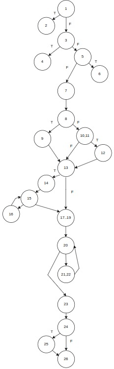

# Testare Unitara in C#
## Descriere
Aplicatia pune la dispozitie o interfata simpla la nivel de consola, ce ajuta la calcularea si planificarea unei calatorii in functie de distanta, numarul de pasageri si costuri suplimentare.

# Functional Testing
Functional testing este o metoda de testare software care se concentreaza pe validarea functionalitatilor unui sistem, asigurandu-se ca acestea corespund specificatiilor si cerintelor definite.

## 1. Partitionarea in clase de echivalenta
Domeniul intrarilor:
* distanceInKm $\rightarrow$ numar real mai mare sau egal cu $5$ km. Astfel, avem 2 clase de echivalenta:
    - $D_1$ = $(-\infty, 5)$.
    - $D_2$ = $[5, +\infty)$.
* passengers $\rightarrow$ numar intreg pozitiv, strict mai mare ca $0$ si mai mic sau egal cu $25$. Astfel, avem 3 clase de echivalenta:
    - $P_1$ = $[1, 25]$.
    - $P_2$ = $\lbrace n | n < 1 \rbrace$.
    - $P_3$ = $\lbrace n | n > 25 \rbrace$.
* includeRests $\rightarrow$ boolean $(True | False)$. Deci avem 2 clase de echivalenta:
    - $R_1$ = $\lbrace True \rbrace$.
    - $R_2$ = $\lbrace False \rbrace$.

Domeniul iesirilor:\
Se returneaza costul total. Daca datele sunt corecte, totalul va fi mereu calculat si returnat, altfel se va afisa o eroare prin intermediul unei exceptii.\
Clasele de echivalenta globale astfel obtinute sunt:
* $Eq_{1} = \lbrace (d, p^{-}, r^{-}) | d \in D_{1} \rbrace$.
    - $T_{1} = (4, \textunderscore, \textunderscore)$.
* $Eq_{211} = \lbrace (d, p, r) | d \in D_2, p \in P_1, r \in R_1 \rbrace$.
    - $T_{211} = (100, 3, True)$.
* $Eq_{212} = \lbrace (d, p, r) | d \in D_2, p \in P_1, r \in R_2 \rbrace$.
    - $T_{212} = (100, 3, False)$.
* $Eq_{22} = \lbrace (d, p, r^{-}) | d \in D_2, p \in P_2 \rbrace$.
    - $T_{22} = (100, 0, \textunderscore)$.
* $Eq_{23} = \lbrace (d, p, r^{-}) | d \in D_2, p \in P_3 \rbrace$.
    - $T_{23} = (100, 30, \textunderscore)$.

|   Intrari (d, p, r)   |   Expected    |
| :---------: | :-----------: |
| $(4, \textunderscore, \textunderscore)$ | Cere ca distanta sa fie macar 5 kilometrii. |
| $(100, 3, True)$ | Se returneaza totalul de $88,4$. |
| $(100, 3, False)$ | Se returneaza totalul de $60,4$. |
| $(100, 0, \textunderscore)$ | Cere ca numarul de persoane sa fie minim 1. |
| $(100, 30, \textunderscore)$ | Cere ca numarul de persoane sa fie maxim 25. |

## 2. Analiza valorilor de frontiera
* Valorile de frontiera pentru clasa distantei sunt:
    - $D_1 \rightarrow 5 - \epsilon$.
    - $D_2 \rightarrow 5$.
* Valorile de frontiera pentru clasa pasagerilor sunt:
    - $P_1 \rightarrow 1, 25$.
    - $P_2 \rightarrow 0$.
    - $P_3 \rightarrow 26$.

Iar $includeRests$ poate lua 2 valori, deci vom avea urmatoarele 7 teste:
* $Eq_{1} \rightarrow (5 - \epsilon, \textunderscore, \textunderscore)$.
* $Eq_{211} \rightarrow (5, 1, True), (5, 25, True)$.
* $Eq_{212} \rightarrow (5, 1, False), (5, 25, False)$.
* $Eq_{22} \rightarrow (5, 0, \textunderscore)$.
* $Eq_{23} \rightarrow (5, 26, \textunderscore)$.

|   Intrari (d, p, r)   |   Expected    |
| :---------: | :-----------: |
| $(5 - \epsilon, \textunderscore, \textunderscore)$ | Cere ca distanta sa fie macar 5 kilometrii. |
| $(5, 1, True)$ | Se returneaza totalul de $4,05$. |
| $(5, 25, True)$ | Se returneaza totalul de $3,55$. |
| $(5, 1, False)$ | Se returneaza totalul de $4,05$. |
| $(5, 25, False)$ | Se returneaza totalul de $3,55$. |
| $(5, 0, \textunderscore)$ | Cere ca numarul de persoane sa fie minim 1. |
| $(5, 26, \textunderscore)$ | Cere ca numarul de persoane sa fie maxim 25. |

## 3. Category Partitioning
1. Descompune specificatia în unități: avem o singură unitate.
2. Identifică parametrii: distanceInKm (d), passengers (p), includeRests (r).
3. Categorii:
    * d $\rightarrow$ daca este in intervalul valid $[5, +\infty)$.
    * p $\rightarrow$ daca este in intervalul valid $[1, 25]$.
    * r $\rightarrow$ daca este $True$ sau $False$.
4. Partiționeaza fiecare categorie în alternative:
    * d: $<5 - \epsilon, 5, 5 + \epsilon, 10, 100, 750, ...>$.
    * p: $<0, 1, 2, 3, ..., 25, 26>$.
    * r: $True$ sau $False$.
5. Scrie specificația de testare:
    * distanceInKm:
        - $\lbrace d | d < 5 \rbrace$.
        - $5 - \epsilon$.
        - 5.
        - 100 (distanta mica).
        - 750 (distanta mare/costuri suplimentare).
    * passengers:
        - $\lbrace p | p < 0 \rbrace$.
        - 0.
        - $1$ (minim + se aplica taxe suplimentare).
        - $2 .. 24$ (mediu).
        - $6$ (se aplica discount).
        - $25$ (maxim).
        - 26.
        - $\lbrace p | p > 26 \rbrace$.
    * includeRests:
        - $True$.
        - $False$.

Se observa ca pentru a testa toate categoriile vom avea nevoie de 5 $\cdot$ 8 $\cdot$ 2 = 80 de teste. Putem elimina cazurile care nu au sens, cum ar fi distanta prea mica $< 5$, distantele prea mari, numar negativ de pasageri, numar prea mare de pasageri. Astfel putem analiza 23 teste:

|   Intrari (d, p, r)   |   Expected    |
| :---------: | :-----------: |
| $(5 - \epsilon, \textunderscore, \textunderscore)$ | Cere ca distanta sa fie macar 5 kilometrii. |
| $(5, 0, \textunderscore)$ | Cere ca numarul de persoane sa fie minim 1. |
| $(100, 0, \textunderscore)$ | Cere ca numarul de persoane sa fie minim 1. |
| $(750, 0, \textunderscore)$ | Cere ca numarul de persoane sa fie minim 1. |
| $(5, 26, \textunderscore)$ | Cere ca numarul de persoane sa fie maxim 25. |
| $(100, 26, \textunderscore)$ | Cere ca numarul de persoane sa fie maxim 25. |
| $(750, 26, \textunderscore)$ | Cere ca numarul de persoane sa fie maxim 25. |
| $(5, 1, True)$ | Se returneaza totalul de $4,05$. |
| $(5, 1, False)$ | Se returneaza totalul de $4,05$. |
| $(5, 3, True)$ | Se returneaza totalul de $3,8$. |
| $(5, 3, False)$ | Se returneaza totalul de $3,8$. |
| $(5, 6, True)$ | Se returneaza totalul de $3,55$. |
| $(5, 6, False)$ | Se returneaza totalul de $3,55$. |
| $(5, 25, True)$ | Se returneaza totalul de $3,55$. |
| $(5, 25, False)$ | Se returneaza totalul de $3,55$. |
| $(750, 1, True)$ | Se returneaza totalul de $714,8$. |
| $(750, 1, False)$ | Se returneaza totalul de $504,8$. |
| $(750, 3, True)$ | Se returneaza totalul de $677,3$. |
| $(750, 3, False)$ | Se returneaza totalul de $467,3$. |
| $(750, 6, True)$ | Se returneaza totalul de $671,79$. |
| $(750, 6, False)$ | Se returneaza totalul de $451,29$. |
| $(750, 25, True)$ | Se returneaza totalul de $671,79$. |
| $(750, 25, False)$ | Se returneaza totalul de $451,29$. |


# Structural Testing
Structural testing, cunoscuta si ca white-box testing, se concentreaza pe verificarea interna a codului sursa. Practic, se testeaza structura logica a programului si se asigura ca toate partile acestuia functioneaza conform asteptarilor.

```c#
public double TotalTripCost(double distanceInKm, int passengers, bool includeRests) {
1.     if (distanceInKm < 5.0)
2.         throw new ArgumentOutOfRangeException(nameof(distanceInKm), "Distance should be positive and at least five kilometers.");
3.     if (passengers <= 0)
4.         throw new ArgumentOutOfRangeException(nameof(passengers), "Number of passengers should be at least one.");
5.     else if (passengers > 25)
6.         throw new ArgumentOutOfRangeException(nameof(passengers), "Number of passengers should be maximum 25.");
7.     double total = distanceInKm * DistanceService.BasePerKm;
8.     if (passengers > DistanceService.MinimumPeopleForDiscount) {
9.         total *= 0.9;
10.     } else {
11.         if (passengers < DistanceService.MaximumPeopleForBase) {
12.             total *= 1.1;}}
13.     if (includeRests) {
14.         int stops = (int) Math.Floor(distanceInKm / DistanceService.DistancePerStop);
15.         for (int i = 0; i < stops; ++i) {
16.             total += DistanceService.CostPerStop;}}
17.     double efficiency = 10;
18.     double remaining = distanceInKm;
19.     double fuelNeeded = 0.0;
20.     while (remaining > 0.0) {
21.         fuelNeeded += 1.0;
22.         remaining -= efficiency * (1.0 + (1.0 / fuelNeeded));}
23.     total += fuelNeeded * 1.3;
24.     if ((passengers > DistanceService.MinimumPeopleForDiscount) && (distanceInKm > 500)){
25.         total *= 1.05;}
26.     return total;}
```



## 4. Statement Testing
Verificam daca fiecare instructiune din cod a fost executata cel putin o data.

|   Intrari (d, p, r)   |   Expected    | Decizii acoperite |
| :---------: | :-----------: | :-----------: |
| $(5 - \epsilon, \textunderscore, \textunderscore)$ | Testeaza ramura in care distanta este macar 5 kilometrii. |  1,2 |
| $(10, 0, \textunderscore)$ | Testeaza ramura in care numarul de persoane este minim 1. | 1,3,4 |
| $(10, 30, \textunderscore)$ | Testeaza ramura in care numarul de persoane este maxim 25. | 1,3,5,6 |
| $(50, 1, False)$ | Testeaza ramura in care numarul de persoane este mai mic decat numarul maxim de persoane de baza si returneaza totalul de 32.7 | 1,3,5,7,8,10,11,12,13,17,18,19,20,21,22,23,24,26 |
| $(600, 6, True)$ | Testeaza ramura in care numarul de persoane este mai mare decat numarul minim de persoane pentru discount, daca sunt incluse stopuri in calatorie si daca distanta este mai mare decat 500 de km iar returneaza totalul de 536.34 | 1,3,5,7,8,9,13,14,15,16,17,18,19,20,21,22,23,24,25,26 |

```c#
    [Fact]
        public void StatementCoverage(){
            // 1. Test pentru distanta invalida (< 5 km)
            Action act = () => _distanceService.TotalTripCost(
                distanceInKm: 4,
                passengers: 5,
                includeRests: false
            );
            var exception = Assert.Throws<ArgumentOutOfRangeException>(act);
            Assert.Equal("Distance should be positive and at least five kilometers. (Parameter 'distanceInKm')", exception.Message);

            // 2. Test pentru numar de pasageri invalid (0 pasageri)
            act = () => _distanceService.TotalTripCost(
                distanceInKm: 10,
                passengers: 0,
                includeRests: false
            );
            exception = Assert.Throws<ArgumentOutOfRangeException>(act);
            Assert.Equal("Number of passengers should be at least one. (Parameter 'passengers')", exception.Message);

            // 3. Test pentru numar de pasageri invalid (> 25 pasageri)
            act = () => _distanceService.TotalTripCost(
                distanceInKm: 10,
                passengers: 30,
                includeRests: false
            );
            exception = Assert.Throws<ArgumentOutOfRangeException>(act);
            Assert.Equal("Number of passengers should be maximum 25. (Parameter 'passengers')", exception.Message);

            // 4. Test pentru ramura care aplică majorare (pasageri < MaximumPeopleForBase)
            //    Pentru pasageri=1 (1 < 2), se aplică un factor de 1.1
            //    Sa folosim o distanta de 50 km si sa nu includem opririle.
            //    Calcul:
            //      - Cost de baza: 50 * 0.5 = 25
            //      - Majorare: 25 * 1.1 = 27.5
            //      - Calcul combustibil:
            //           Iteratia 1: fuelNeeded = 1, remaining = 50 - 10*(1+1)=50-20=30.
            //           Iteratia 2: fuelNeeded = 2, remaining = 30 - 10*(1+0.5)=30-15=15.
            //           Iteratia 3: fuelNeeded = 3, remaining = 15 - 10*(1+0.3333)=15-13.33≈1.67.
            //           Iteratia 4: fuelNeeded = 4, remaining = 1.67 - 10*(1+0.25)=1.67-12.5≈-10.83 → fuelNeeded=4.
            //      - Cost combustibil: 4 * 1.3 = 5.2
            //      - Total asteptat: 27.5 + 5.2 = 32.7
            double total = _distanceService.TotalTripCost(
                distanceInKm: 50,
                passengers: 1,
                includeRests: false
            );
            Assert.Equal(32.7, total);

            // 5. Test pentru ramura de discount (pasageri > MinimumPeopleForDiscount) si pentru includerea oprirlor (includeRests true) si pentru taxa suplimentara
            // la calatorii lungi
            //    Pentru 600 km, pasageri = 6:
            //      - Cost de bază: 300
            //      - Discount: 300 * 0.9 = 270
            //      - Stops: 600/25=24
            //      - Total cu taxa de stopuri: 270 + 7 * 24 = 438
            //      - Calcul combustibil:
            //            Se simulează calculul iterativ pentru 600 km.
            //      - Total intermediar: 438 + (fuelNeeded * 1.3)
            //      - Aplicare taxa suplimentara: total * 1.05
            total = _distanceService.TotalTripCost(
                distanceInKm: 600,
                passengers: 6,
                includeRests: true
            );
            Assert.Equal(536.34, total);    
        }
```


## 5. Decision Testing
Asiguram ca fiecare punct de decizie (de exemplu, instructiunile if) este evaluat atat pentru conditia adevarata, cat si pentru cea falsa.

| Nr. | Decizie                                                                               |
|-----|---------------------------------------------------------------------------------------|
| 1   | `if (distanceInKm < 5.0)`                                                             |
| 2   | `if (passengers <= 0)`                                                                |
| 3   | `else if (passengers > 25)`                                                           |
| 4   | `if (passengers > DistanceService.MinimumPeopleForDiscount)`                          |
| 5   | `else if (passengers < DistanceService.MaximumPeopleForBase)`                         |
| 6   | `if (includeRests)`                                                                   |
| 7   | `for (int i = 0; i < stops; ++i)`                                                     |
| 8   | `while (remaining > 0.0)`                                                             |
| 9   | `if ((passengers > DistanceService.MinimumPeopleForDiscount) && (distanceInKm > 500))`|

Decizia 8 nu poate vreodata sa fie falsa intrucat daca folosim o distanta 0, nu va ajunge la Decizia 8 intrucat va iesi din program si va arunca exceptia cand testatam prima decizie

| Test | distanceInKm | passengers | includeRests | Rezultatul afișat                                                        | Decizii acoperite                                                                                  |
|------|----|----|-------|---------------------------------------------------------------------------|----------------------------------------------------------------------------------------------------|
| T1   | 4 | 5 | false | Testeaza ramura in care distanta este macar 5 kilometrii. | D1-true                                                                                            |
| T2   | 10 | 0   | false | Testeaza ramura in care numarul de persoane este minim 1.            | D1-false,   D2-true                                                                                  |
| T3   | 10 | 26 | false | Testeaza ramura in care numarul de persoane este maxim 25.             | D1-false, D2-false, D3-true                                                                        |
| T4   | 10 | 1 | false | Testeaza ramura in care numarul de persoane este mai mic decat numarul maxim de persoane de baza si returnează cost = 6.30                                                     | D5-true, D1-false, D2-false, D3-false, D4-false, D6-false, D9-false                                 |
| T5   | 24 | 2 | true | Testeaza ramura in care numarul de persoane este mai mare sau egal decat numarul maxim de persoane de baza, este mai mic decat numarul minim de persoane de baza, ca sunt incluse stopuri ca si posibilitate dar ele nu sunt, ca distanta este mai mica decat 500 de km si returnează cost = 14.6                                                     | D6-true, D1-false, D2-false, D3-false, D4-false, D5-false, D7-false, D9-false                                 |
| T6   | 600  | 6 | true | Testeaza ramura in care numarul de persoane este mai mare decat numarul minim de persoane pentru discount, daca sunt incluse stopuri in calatorie si daca distanta este mai mare decat 500 de km iar returnează cost ≈ 536.34                                                    | D1-false, D2-false, D3-false, D4-true,  D5-false, D6-true, D7-true, D9-true                                   |

```c#
[Fact]
        public void DecisionCoverage(){
            // Testarea 1: D1-true
            Action act = () => _distanceService.TotalTripCost(
                distanceInKm: 4,
                passengers: 5,
                includeRests: false
            );
            var exception = Assert.Throws<ArgumentOutOfRangeException>(act);
            Assert.Equal("Distance should be positive and at least five kilometers. (Parameter 'distanceInKm')", exception.Message);

            // Testarea 2: D2-true, D1-false
            act = () => _distanceService.TotalTripCost(
                distanceInKm: 10,
                passengers: 0,
                includeRests: false
            );
            exception = Assert.Throws<ArgumentOutOfRangeException>(act);
            Assert.Equal("Number of passengers should be at least one. (Parameter 'passengers')", exception.Message);

            // Testarea 3: D3-true, D1-false, D2-false
            act = () => _distanceService.TotalTripCost(
                distanceInKm: 10,
                passengers: 26,
                includeRests: false
            );
            exception = Assert.Throws<ArgumentOutOfRangeException>(act);
            Assert.Equal("Number of passengers should be maximum 25. (Parameter 'passengers')", exception.Message);

            // Testarea 4: D5-true, D1-false, D2-false, D3-false, D4-false, D6-false, D9-false
            double total = _distanceService.TotalTripCost(
                distanceInKm: 10,
                passengers: 1,
                includeRests: false
            );
            Assert.Equal(6.8, total);

            // Testarea 5:  D6-true, D1-false, D2-false, D3-false, D4-false, D5-false, D7-false, D9-false
            total = _distanceService.TotalTripCost(
                distanceInKm: 24,
                passengers: 2,
                includeRests: true
            );
            Assert.Equal(14.6, total);

            //Testarea 6: D4-true, D6-true, D7-true, D9-true, D1-false, D2-false, D3-false, D5-false
            total = _distanceService.TotalTripCost(
                distanceInKm: 600,
                passengers: 6,
                includeRests: true
            );
            Assert.Equal(536.34, total);
       }
```


## 6. Condition Testing
Se concentreaza pe evaluarea fiecarei conditii individuale din cadrul unei decizii, asigurandu-se ca fiecare sub-conditie a fost testata pentru ambele valori logice(adevarat si fals).

| Nr. | Decizie                                                                            | Condiții individuale                                |
|----|------------------------------------------------------------------------------------|-----------------------------------------------------|
| 1 | `if (distanceInKm < 5.0)`                                                          | `distanceInKm < 5.0`                                |
| 2 | `if (passengers <= 0)`                                                             | `passengers <= 0`                                   |
| 3 | `else if (passengers > 25)`                                                        | `passengers > 25`                                   |
| 4 | `if (passengers > MinimumPeopleForDiscount)`                                       | `passengers > MinimumPeopleForDiscount`             |
| 5 | `else if (passengers < MaximumPeopleForBase)`                                      | `passengers < MaximumPeopleForBase`                 |
| 6 | `if (includeRests)`                                                                | `includeRests == true`                              |
| 7 | `for (int i = 0; i < stops; ++i)`                                                  | `i < stops`                                         |
| 8 | `while (remaining > 0.0)`                                                          | `remaining > 0.0`                                   |
| 9 | `if ((passengers > MinimumPeopleForDiscount) && (distanceInKm > 500))`             | `passengers > MinimumPeopleForDiscount`<br>`distanceInKm > 500` |

Conditia 8 nu poate vreodata sa fie falsa intrucat daca folosim o distanta 0, nu va ajunge la Conditia 8 intrucat va iesi din program si va arunca exceptia cand testatam prima conditie

| Test | distanceInKm | passengers | includeRests | Rezultatul afișat                                                                                                 | Condiții acoperite                                                                          |
|------|--------------|------------|--------------|-------------------------------------------------------------------------------------------------------------------|----------------------------------------------------------------------------------------------|
| T1   | 4            | 5          | false        | Testează ramura în care distanța este mai mică decât 5 kilometri.                                                  | C1-true                                                                                      |
| T2   | 10           | 0          | false        | Testează ramura în care numărul de persoane este minim 1.                                                          | C1-false, C2-true                                                                           |
| T3   | 10           | 26         | false        | Testează ramura în care numărul de persoane este maxim 25.                                                         | C1-false,C2-false C3-true                                                                                      |
| T4   | 10           | 1          | false        | Testează ramura în care numărul de persoane este mai mic decât numărul maxim de persoane de bază și returnează cost = 6.30 | C1-false,C2-false,C3-false, C4-false, C5-true, C6-false, C9-false                                                        |
| T5   | 24           | 2          | true        | Testeaza ramura in care numarul de persoane este mai mare sau egal decat numarul maxim de persoane de baza, este mai mic decat numarul minim de persoane de baza, ca sunt incluse stopuri ca si posibilitate dar ele nu sunt, ca distanta este mai mica decat 500 de km si returnează cost = 14.6 | C1-false,C2-false,C3-false,C4-false, C5-false, C6-true, C7-false, C9-false                                                       |
| T6   | 600          | 6          | true         | Testează ramura în care numărul de persoane este mai mare decât minimul pentru discount, se includ opriri și distanța este peste 500 km; returnează cost ≈ 536.34. | C1-false, C2-false, C3-false, C4-true, C5-false, C6-true, C7-true,C9-true                                                          |

```c#
[Fact]
        public void ConditionCoverage(){
            // Testarea 1: C1-true
            Action act = () => _distanceService.TotalTripCost(
                distanceInKm: 4,
                passengers: 5,
                includeRests: false
            );
            var exception = Assert.Throws<ArgumentOutOfRangeException>(act);
            Assert.Equal("Distance should be positive and at least five kilometers. (Parameter 'distanceInKm')", exception.Message);

            // Testarea 2: C2-true, C1-false
            act = () => _distanceService.TotalTripCost(
                distanceInKm: 10,
                passengers: 0,
                includeRests: false
            );
            exception = Assert.Throws<ArgumentOutOfRangeException>(act);
            Assert.Equal("Number of passengers should be at least one. (Parameter 'passengers')", exception.Message);

            // Testarea 3: C3-true, C1-false, C2-false
            act = () => _distanceService.TotalTripCost(
                distanceInKm: 10,
                passengers: 26,
                includeRests: false
            );
            exception = Assert.Throws<ArgumentOutOfRangeException>(act);
            Assert.Equal("Number of passengers should be maximum 25. (Parameter 'passengers')", exception.Message);

            // Testarea 4: C5-true, C1-false, C2-false, C3-false, C4-false, C6-false, C9-false
            double total = _distanceService.TotalTripCost(
                distanceInKm: 10,
                passengers: 1,
                includeRests: false
            );
            Assert.Equal(6.8, total);

            // Testarea 5:  C6-true, C1-false, C2-false, C3-false, C4-false, C5-false, C7-false, C9-false
            total = _distanceService.TotalTripCost(
                distanceInKm: 24,
                passengers: 2,
                includeRests: true
            );
            Assert.Equal(14.6, total);

            //Testarea 6: C4-true, C6-true, C7-true, C9-true, C1-false, C2-false, C3-false, C5-false
            total = _distanceService.TotalTripCost(
                distanceInKm: 600,
                passengers: 6,
                includeRests: true
            );
            Assert.Equal(536.34, total);
        }
```


